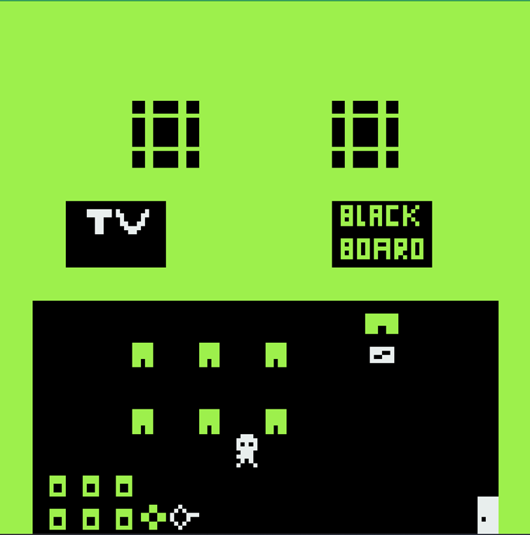

# The Voyager (French version)
## Description du jeu
### Synopsis

&#x1F604; *The Voyager (French version)* est une petite histoire de voyage dans le temps. Il vous sera possible de découvrir un univers insonore un peu bizarre et de faire des rencontres quelque peu humoristiques dans le but de réparer une machine qui vous permettra de débloquer la situation dans laquelle vous vous trouvez au début du jeu. &#x1F604;

### Fonctionnalités
#### Déplacements

Il vous sera possible de voyager entre plusieurs scènes représentant différentes époques. 

#### Interactions

Vous pourrez jouer et rejouer à *The Voyager (French version)* afin d'interagir avec des objets, des animaux ou des personnages qui vous permettront de créer des versions alternatives du récit auquel vous appartenez.

#### Dialogues

Les dialogues sont centraux. Qu'ils soient longs, courts, parfois incompréhensibles, ils vous entraîneront, je l'espère, dans cet univers que je souhaite vous faire découvrir.

## Procédure de lancement

*The Voyager (French version)* se lance directement lorsque vous arrivez sur la page itch.io qui lui est dédiée, à l'adresse suivante : https://ar26.itch.io/the-voyager-french-version. 

Sur un PC ou un Mac, cliquez sur la fenêtre du jeu avec votre souris ou votre pavé tactile. Utilisez ensuite n'importe quelle touche de votre clavier pour débuter la partie.

*The Voyager (French version)* n'est pas compatible avec les smartphones, mais vous pouvez y jouer sur les tablettes. Il vous faudra alors cliquer à l'endroit de votre choix dans la fenêtre du jeu avec l'un de vos doigts ou un stylet pour le lancer.

## Moteur de jeu et outil de capture utilisés

Ce jeu a été développé avec Bitsy (https://www.bitsy.org/). La capture d'écran présentée plus haut a été réalisée à l'aide de l'outil intégré à Windows 11.

## Recours à l'IA

La version gratuite de ChatGPT (GPT-5.3-mini et GPT 5.5) et Microsoft 365 Copilot que fournit l'UNIL (GPT-5 chat) m'ont été utiles pour développer *The Voyager (French version)*.

Aucune ligne de code du jeu n'a été générée par l'IA, mais celle-ci a, par exemple, été précieuse pour la vérification des droits d'auteur, pour la création de ce document, ainsi que pour la correction de l'orthographe et de la grammaire dans les dialogues, les noms des éléments du jeu et le texte que vous lisez en ce moment. 

Par ailleurs, ChatGPT a notamment été utilisé à plusieurs reprises afin de générer le design du jeu. Ce sont des objets, des éléments de décor ou des personnages qui ont parfois été adaptés à partir de ces générations ou bien qui ont été utilisés tels qu'ils ont été proposés. 

Microsoft 365 Copilot a également été une aide dans la création du scénario de ce jeu. Certains dialogues ont été proposés directement et certaines idées ont permis de les imaginer. 

Quelques exemples de prompts essentiels, reformulés pour plus de clarté, sont : 
1. Est-ce que tu peux me diriger afin de dessiner un avatar ou un sprite pour mon jeu Bitsy ?
2. Dessine-moi un mouton (un mouton de l'Antiquité) ?
3. Fournir des prénoms de barbares germaniques (expression anachronique) de l'époque romaine qu'on pouvait croiser aux frontières de l'Empire au IIe siècle après J.-C.
4. Est-ce que la campagne aux alentours de Rome est riche en un quelconque minerai ? Si oui, lequel ?
5. Est-ce que tu peux me traduire ce dialogue en latin ?
6. Est-ce que cette information est légale ? Réutilisable ?
7. Comment insérer une image dans un fichier Markdown ?
8. Est-ce qu'il y a des fautes (orthographe, grammaire, conjugaison) ?

## Contexte de développement

Ce projet a été développé au printemps 2026 pour le cours « Développement de jeux vidéo 2D » dispensé par Monsieur Loïc Cattani (SLI, Lettres, UNIL).
